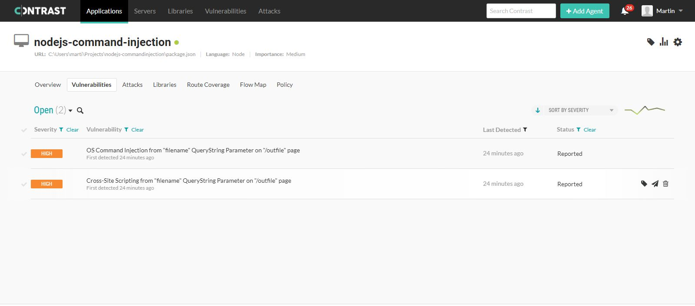

# Command and SQL Injection in a Nodejs + Express Server
The parameter filename on the URL /outfile runs an EXEC function which is insecure

Standard URL  
http://localhost:3000/outfile?filename=outputfile.txt

URL with Code injection  
http://localhost:3000/outfile?filename=outputfile.txt|ls%20-la

Safe URL  
http://localhost:3000/outsafe?filename=outputfile.txt  
http://localhost:3000/outsafe?filename=outputfile.txt|ls%20-la

This URL uses the EXECFILE function which can not chain commands
The filename is also validated whether it does contain suspicious characters
Additionally the Webpage output of the filename is URI encoded so safe for output

SQL Injection  
http://localhost:3000/sql?price=50  
http://localhost:3000/sql?price=50;SELECT%20*%20FROM%20PRODUCTS  


# Install and run

To install this repository on your computer youe need Node.js V12 installed 

Run:  

```
git clone https://github.com/Cookiemovies/nodejs-commandinjection  
npm install  
```

In order to see the Contrast Security results you need to create your contrast_security.yaml file  

Then run: 

```
npm install @contrast/agent 
```

For running the nodejs/express application:  

```
npm start  
```

For running the nodejs/express application including the Contrast Agent:  

```
npm contrast  
```

# Result from Contrast Security regarding code injection



The 2 high security issues are in /outfile.
In /outsafe the issues are resolved and you have a secure application.